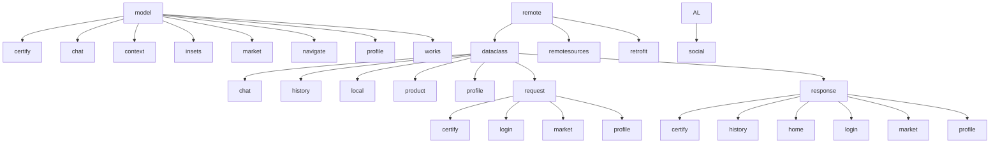
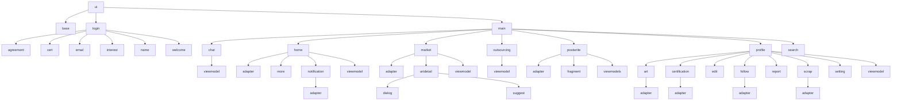

# Sinzak Android

## Spec Sheet

    
    
    
    

## Description

Sinzak Android is an online outsourcing and art market platform for students in art college. This project uses the MVVM pattern, where the View observes the ViewModel, the ViewModel observes the Storage, and the Storage requests data fetch from the RemoteSource created by Retrofit. The MainActivity has several fragments and a Navigation class, which holds information about page stacks. The MainActivity reads the value of the page stack and shows the top page fragment.

## Directory Structure

## Technologies Used

Core-KTX: 1.7.0
Retrofit: 2.9.0
OkHttp: 4.9.3
KTX: 2.5.1
Hilt-Android: 2.44
License
This project is licensed under the MIT License - see the LICENSE file for details.

## Contributing

Contributions are always welcome! If you'd like to contribute, please fork the repository and create a pull request.
